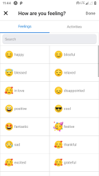
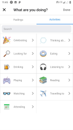
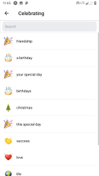
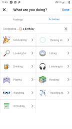

# facebook-feelings-and-activities
Facebook feelings and activities module built with React Native

<b>Instructions to run the application</b>
* Download the code.
* Install the required packages.
* Run the code.

<b>Screenshots</b>
  

